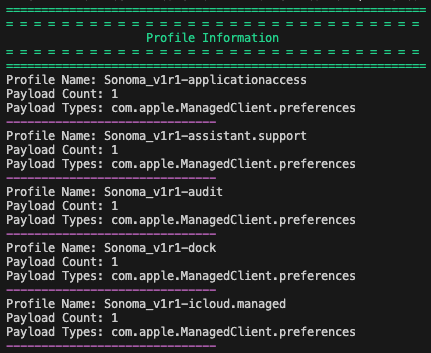
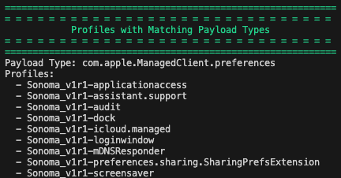

# MacOS Configuration Profile Scripts

This folder hosts a collection of scripts designed to manage and analyze macOS configuration profiles. These scripts assist system administrators and security professionals in extracting, reviewing, and analyzing configuration profiles, providing valuable insights into payload types and their distribution.

## Available Scripts

### 1. [MacOS Configuration Profiles Checker](https://github.com/cocopuff2u/MacOS_GOV_Scripts/blob/main/Configuration_Profile_Scripts/MacOS_Configuration_Analyzer.py)

- **Description**: This script extracts and analyzes macOS configuration profiles. It parses the profiles, extracts key details, and identifies profiles with matching payload types, offering a comprehensive view of configuration profiles.
- **Usage**: Run the script to generate a detailed report on each profile's name, payload count, and types. The script also identifies payload types that are present in multiple profiles.

  

  

  **Note**: Administrative privileges are required to execute the `profiles` command. Ensure you have the necessary permissions before running the script.

#### Script Requirements

- **Python 3**: The script requires Python 3 to run. Make sure Python 3 is installed on your system.
- **Administrative Privileges**: The `profiles` command used in the script requires `sudo` to access and analyze macOS configuration profiles.

## Running the Scripts

To execute any script, follow these steps:

1. **Navigate to the Script Directory**:
   ```bash
   cd /path/to/scripts
   ```

2. **Run the Script**:
   ```bash
   sudo python3 script_name.py
   ```

   Replace `script_name.py` with the actual name of the script you wish to run.

   For example, if you are running the `MacOS Configuration Profiles Checker` script located in your Downloads folder:

   ```bash
   cd ~/Downloads
   sudo python3 MacOS_Configuration_Profiles_Checker.py
   ```
