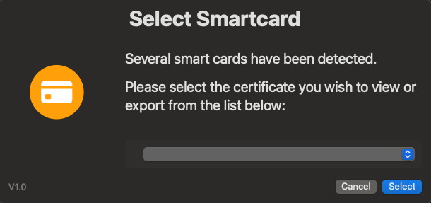

# Keychain & Certificate Scripts

This folder contains scripts for managing macOS keychains and certificates. The scripts facilitate tasks such as adding or removing certificates, listing keychains, and exporting certificate details. These utilities are designed to simplify and automate keychain and certificate management on macOS systems.

## Script Variables

Each script includes variables that can be tailored to produce different types of logs on your local machine. Adjust these settings as needed. Here are some examples:

```bash
ENABLE_LOGGING=true  # Disables logging output [ true (default) | false ]
LOG_FILE="/var/log/Keychain_Dump.log"  # Default log path [ /var/log/Keychain_Dump.log ]
CLEAR_LOGS=true  # Clears existing local logs before running [ true (default) | false ]

FILTER_DOD=true  # Hides all DoD/DOD certificates present in the keychains
FILTER_CRITERIA=""  # Comma-separated list of additional filtering criteria, e.g., "apple,adobe"

MAKE_TERMINAL_COLORFUL=true  # Adds color to terminal output * Requires HIDE_RESULTS_IN_TERMINAL=false * [ true (default) | false ]
HIDE_TERMINAL_OUTPUT=false  # Show output in terminal when running script locally [ true | false (default) ]
```

To modify these variables, open the script in your preferred IDE (such as Visual Studio Code) and adjust the relevant line from `true` to `false`. For example:

```bash
### BEFORE
HIDE_TERMINAL_OUTPUT=false  # Show output in terminal when running script locally [ true | false (default) ]

### AFTER
HIDE_TERMINAL_OUTPUT=true  # Show output in terminal when running script locally [ true | false (default) ]
```

## Executing Scripts

To execute a script, use the command `sudo bash` followed by the script's name. For example:

```bash
sudo bash "PATH/TO/SCRIPT/Keychain Certificate Dumper.sh"
```

*Note:* The file path will depend on where you downloaded the file. For example, if saved to the Downloads folder in your home directory, the command would be:

```bash
sudo bash "~/downloads/Keychain Certificate Dumper.sh"
```

## Scripts and Automation Tools

- **[Import DoD Certificates](https://github.com/cocopuff2u/MacOS_GOV_Scripts/blob/main/Keychain_And_Certificates_Scripts/Import_DoD_Certs.sh)**: Streamline your certificate management with this script that automates the import of DoD certificates directly from a government source into your macOS system keychain, ensuring both security and compliance.

You can easily run this script directly from the terminal with the following command:
```bash
sudo bash -c "$(curl -s https://raw.githubusercontent.com/cocopuff2u/MacOS_GOV_Scripts/main/Keychain_And_Certificates_Scripts/Import_DoD_Certs.sh)"
```


- **[Keychain Certificate Dumper](https://github.com/cocopuff2u/MacOS_GOV_Scripts/blob/main/Keychain_And_Certificates_Scripts/Keychain_Certificate_Dumper.sh)**: Exports a log of all keychain certificates on macOS, providing a detailed record for secure certificate management.

  

- **[SmartCard Dumper](https://github.com/cocopuff2u/MacOS_GOV_Scripts/blob/main/Keychain_And_Certificates_Scripts/SmartCardDumper.zsh)**: Displays and/or exports all certificates from the local smartcard/s present on the device.



