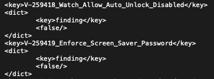
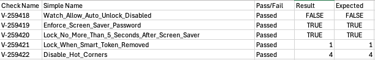
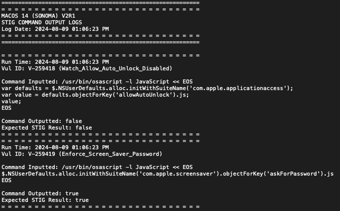
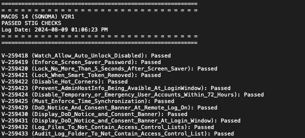
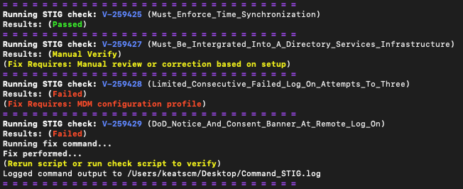
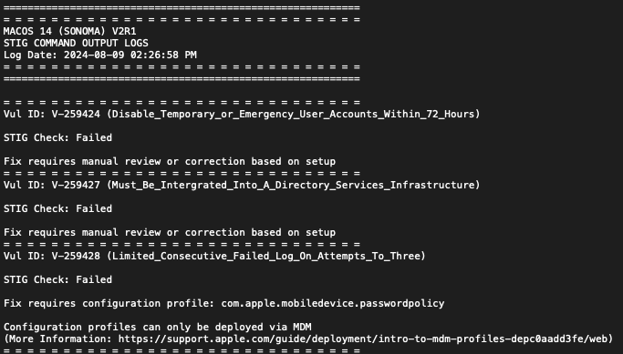

# MacOS 15 (Sequoia) DISA STIG Tools

**Important:** These tools are designed to address MacOS Sequoia STIG requirements and will modify settings on your MacOS.

Please note that not all STIG requirements can be fulfilled through command line execution; some necessitate configuration profiles that must be deployed via an MDM. You can access these profiles at [DISA STIGs](https://public.cyber.mil/stigs/), but they are not included in this package. If you have suggestions or encounter issues, please feel free to reach out.

---

## Complementary Tools

- **[Import DoD Certs](https://github.com/cocopuff2u/MacOS_GOV_Scripts/tree/main/Keychain_And_Certificates_Scripts/Import_DoD_Certs.sh)**: Automates the import of DoD certificates.
- **[Keychain Cert Dumper](https://github.com/cocopuff2u/MacOS_GOV_Scripts/tree/main/Keychain%20%26%20Certificates%20Scripts)**: Extracts all keychain certificates for review.

---

## Script Variables

Each script includes customizable variables to generate various types of logs on your local machine. Adjust these settings according to your needs:

```bash
# Script Log Names
MANUAL_LOG_FILE_NAME="sequoia_stig_scan_manual_check.log"  # Logs requiring manual review
PASS_LOG_FILE_NAME="sequoia_stig_scan_passed.log"          # Logs for checks that pass
FAILURE_LOG_FILE_NAME="sequoia_stig_scan_failed.log"        # Logs for checks that fail
SINGLE_LOG_FILE_NAME="sequoia_stig_scan_summary.log"        # Summary of passed and failed checks
COMMAND_LOG_FILE_NAME="sequoia_stig_scan_command_output.log" # Logs command outputs
CSV_LOG_FILE_NAME="sequoia_stig_scan_results_combined.csv"  # Consolidated CSV of results

# Logging Options
CLEAR_LOGS=true                     # Clears existing logs before execution [ true (default) | false ]
LOG_PATH=""                         # Specify a different path [ defaults to /var/log/ if left blank ]
LOG_TO_SINGLE_FILE=false            # Consolidates logs into a single file [ true | false (default) ]
LOG_COMMANDS=true                   # Records commands and outputs in a log file, ideal for STIG compliance [ true (default) | false ]
LOG_RESULTS_TO_USER_LOG_FOLDER=true # Logs results to the user's log folder [ true (default) | false ]
LOG_TO_PLIST=false                  # Logs to a plist file [ true | false (default) ]
LOG_TO_CSV=true                     # Logs to a CSV file [ true | false (default) ]

# Plist Options
PLIST_LOG_FILE="/Library/Preferences/STIG_Checks.plist" # Default log file path

# Other Options
HIDE_RESULTS_IN_TERMINAL=false         # Shows output in the terminal [ true | false (default) ]
MAKE_TERMINAL_COLORFUL=true            # Enables colored terminal output *Requires HIDE_RESULTS_IN_TERMINAL=false* [ true (default) | false ]
HIDE_LOGGING_LOCATION_IN_TERMINAL=true # Hides logging location in terminal output [ true (default) | false ]
HIDE_NONCHIP_SUPPORTED_COMMANDS=true   # Runs only commands compatible with the hardware [ true (default) | false ]
```

To modify these variables, open the script in your preferred IDE (like Visual Studio Code) and adjust the relevant lines as needed:

```bash
### BEFORE
HIDE_RESULTS_IN_TERMINAL=false         # Show output in terminal when running script locally [ true | false (default) ]

### AFTER
HIDE_RESULTS_IN_TERMINAL=true          # Show output in terminal when running script locally [ true | false (default) ]
```

---

## Executing Scripts Locally

To execute the tool, use the following command format, replacing `PATH/TO/SCRIPT` with the actual path:

```bash
sudo bash "PATH/TO/SCRIPT/MacOS_15_Sequoia_V1R1_STIG_Compliance_Tool.sh"
```

**Note:** The file path depends on where you downloaded the script. For instance, if saved in the Downloads folder, use:

```bash
sudo bash "~/downloads/MacOS_15_Sequoia_V1R1_STIG_Compliance_Tool.sh"
```

### Flags for Executing Scripts Locally

When running the compliance tool locally, you can use the following flags to control its behavior:

1. **`-c` (Checks Only)**:
   - This flag instructs the script to perform checks against the system's configuration based on the specified STIGs without making any changes. 
   - Use this to assess compliance and review the output logs without applying any fixes. 
   - **Example Command**:
     ```bash
     sudo bash "PATH/TO/SCRIPT/MacOS_15_Sequoia_V1R1_STIG_Compliance_Tool.sh" -c
     ```

2. **`-f` (Checks and Fixes)**:
   - This flag indicates that the script should perform checks and apply necessary fixes based on the STIG requirements.
   - Use this to automatically correct any non-compliance found during the checks. 
   - **Example Command**:
     ```bash
     sudo bash "PATH/TO/SCRIPT/MacOS_15_Sequoia_V1R1_STIG_Compliance_Tool.sh" -f
     ```

### Summary of Behavior with Flags

- **Without Flags**: By default, if you run the script without any flags, it will perform checks only, providing a safe way to understand your system's compliance status without making changes.
- **With `-c` Flag**: The script explicitly performs checks and logs the results, ensuring a detailed output of the compliance status without applying any fixes.
- **With `-f` Flag**: The script performs checks and applies fixes as needed, helping to automatically remediate issues found during the compliance assessment.

These flags allow you to customize your experience with the tool based on your specific needs, whether you want to evaluate your system's compliance or actively remediate issues.

## Executing Script Remotely

You can run this tool directly from the terminal using the following command:

```bash
sudo bash -c "$(curl -s https://raw.githubusercontent.com/cocopuff2u/MacOS_GOV_Scripts/main/MacOS_Sequoia_STIG_Tools/MacOS_15_Sequoia_V1R1_STIG_Compliance_Tool.sh)"
```

To customize your experience when running the script, you can use the following flags:

- **Checks Only**: Add `-c` to run checks and logs only.

```bash
sudo bash -c "$(curl -s https://raw.githubusercontent.com/cocopuff2u/MacOS_GOV_Scripts/main/MacOS_Sequoia_STIG_Tools/MacOS_15_Sequoia_V1R1_STIG_Compliance_Tool.sh)" -- -c
```

- **Checks/Fixes Only**: Add `-f` to perform checks and apply fixes.

```bash
sudo bash -c "$(curl -s https://raw.githubusercontent.com/cocopuff2u/MacOS_GOV_Scripts/main/MacOS_Sequoia_STIG_Tools/MacOS_15_Sequoia_V1R1_STIG_Compliance_Tool.sh)" -- -f
```

---

## [MacOS 15 Sequoia STIG Compliance Tool](https://github.com/cocopuff2u/MacOS_GOV_Scripts/blob/main/MacOS_Sequoia_STIG_Tools/MacOS_15_Sequoia_V1R1_STIG_Compliance_Tool.sh)

This script evaluates your machine's configuration against the specified DISA STIGs and generates comprehensive logs for the administrator and/or user. It provides various customization options to suit the needs of users aiming to ensure compliance with MacOS STIGs. By default, logs are saved in the `/var/log/` or `~/log` directory, but you can customize the storage location within the script. The script supports output in plist, CSV, and log formats and can apply fixes based on the STIG checks if configured to do so. Below are examples of various outputs and their appearance:

---

### Terminal Log Output

<p align="center">

</p>

### Plist Log Output

<p align="center">

</p>

### CSV Log Output

<p align="center">

</p>

### Command Log Output

<p align="center">

</p>

### Failed/Passed Log Output

<p align="center">

</p>

### Terminal Output

<p align="center">

</p>

### Fixer Command Log Output

<p align="center">

</p>

Here’s a refined version of your **Future Enhancements** section:

---

### Future Enhancements

- **Enhanced XML Support**: Implementing the ability to import XML files into the STIG Viewer, allowing for streamlined compliance reporting and analysis.

- **Integration with MDM Solutions**: Introducing support for Mobile Device Management (MDM) solutions like Jamf and Intune, enabling the provision of extension attributes to ensure device compliance.

### Feedback

We welcome your suggestions for new features or enhancements! Your feedback is invaluable in helping us improve this tool for everyone. Please don’t hesitate to reach out with your ideas.

---
