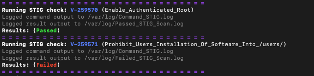
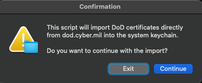
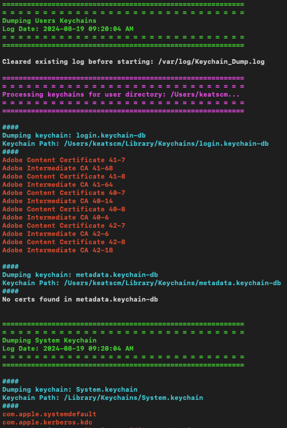

# 🍏 🇺🇸 Government Scripts for macOS  🇺🇸 🍏

A collection of scripts designed to enhance efficiency and security for macOS systems in government environments. Automate tasks, enforce security policies, and streamline management. For installation and usage details, Please refer to the [Wiki](https://github.com/cocopuff2u/MacOS_GOV_Scripts/wiki) or check the script folder for more details. Contributions and feedback are welcome!

## Scripts and Automation Tools

- **[Sequoia STIG Compliance Tools](https://github.com/cocopuff2u/MacOS_GOV_Scripts/blob/main/MacOS_Sequoia_STIG_Tools)**: Automate the process of checking & fixing STIG compliance for macOS Sequoia. This script scans your system and generates a detailed compliance report.
   
  
   

- **[Sonoma STIG Compliance Tools](https://github.com/cocopuff2u/MacOS_GOV_Scripts/blob/main/MacOS_Sonoma_STIG_Tools)**: Automate the process of checking & fixing STIG compliance for macOS Sonoma. This script scans your system and generates a detailed compliance report.
   
  
   

- **[Import DoD Certificates](https://github.com/cocopuff2u/MacOS_GOV_Scripts/blob/main/Keychain_And_Certificates_Scripts)**: Automates the import of DoD certificates into the macOS system keychain, ensuring secure and compliant certificate management.
   
  
   

- **[Keychain Certificate Dumper](https://github.com/cocopuff2u/MacOS_GOV_Scripts/blob/main/Keychain_And_Certificates_Scripts)**: Exports a log of all keychain certificates on macOS, providing a detailed record for secure certificate management.
   
  
   

## Resources

### Useful Links for Mac Admins and Government Compliance

- **[Installomator](https://github.com/Installomator/Installomator)**: Automate software installations.
- **[Nudge](https://github.com/macadmins/nudge)**: Remind users to update macOS.
- **[Super](https://github.com/Macjutsu/super)**: Manage macOS updates and configurations.
- **[swiftDialog](https://github.com/swiftDialog/swiftDialog)**: Create custom dialogs for macOS.
- **[IBM Notifier](https://github.com/IBM/mac-ibm-notifications)**: Create custom dialogs for macOS.
- **[Mist-CLI](https://github.com/ninxsoft/mist-cli)**: A Mac command-line tool that automatically downloads macOS Firmwares / Installers.
- **[MacAdmins Software](https://macadmins.software/)**: Tools and resources for Mac admins.
- **[SOFA](https://sofa.macadmins.io/)**: Community tools and scripts for Mac admins.
- **[Setup Your Mac](https://github.com/setup-your-mac/Setup-Your-Mac)**: Scripted setup for new macOS installations.
- **[MacAdmins Slack](https://macadmins.slack.com/)**: Connect with the Mac admins community.

### Useful Links Related to Government and Security Best Practices

- **[U.S. Cybersecurity and Infrastructure Security Agency (CISA)](https://www.cisa.gov)**: National cybersecurity guidance.
- **[National Institute of Standards and Technology (NIST) Cybersecurity Framework](https://www.nist.gov/cyberframework)**: Framework for improving cybersecurity practices.
- **[Department of Homeland Security (DHS) Cybersecurity](https://www.dhs.gov/cybersecurity)**: DHS cybersecurity resources.
- **[NIST macOS Security Guidance](https://github.com/usnistgov/macos_security)**: Security guidelines for macOS by NIST.
- **[Apple Security Compliance Project](https://support.apple.com/guide/certifications/macos-security-compliance-project-apc322685bb2/web)**: Apple’s security compliance guide for macOS.
- **[Jamf Establishing Compliance Baselines](https://trusted.jamf.com/docs/establishing-compliance-baselines)**: Compliance baseline documentation for macOS.
- **[Public Cybersecurity STIGs](https://public.cyber.mil/stigs/)**: Security Technical Implementation Guides (STIGs) for various systems, including macOS.

## Contact and Feedback

We value your input and encourage you to share your feedback or recommendations! If you want something, say something—your suggestions are crucial for improvement.

- **Report Issues**: Submit an issue on our [GitHub Issues page](https://github.com/cocopuff2u/MacOS_GOV_Scripts/issues) for bug reports or feature requests.
- **Join the Discussion**: Connect with me, cocopuff2u, on the [Mac Admins Slack Channel](https://join.slack.com/t/macadmins/shared_invite/zt-2o5811yhx-q5MNLrFG1VoHRusXLgZwsw) to discuss and collaborate.
- **Email**: Reach out directly at [cocopuff2u@yahoo.com](mailto:cocopuff2u@yahoo.com) for any inquiries.
- **Share Feedback**: We welcome your suggestions and comments to help us improve. Your feedback is crucial, so please feel free to share your thoughts!
- **Fork and Fix**: Want to contribute directly? Fork the repository, make your changes, and submit a pull request to help enhance the code.

## License

This project is licensed under the [MIT License](https://opensource.org/licenses/MIT). See the [LICENSE](https://github.com/cocopuff2u/MacOS_GOV_Scripts/blob/main/LICENSE) file for details.
