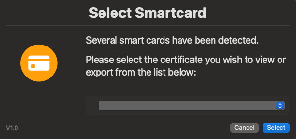

# SmartCard/Cac Tools

This folder contains scripts for managing SmartCards and CACs on macOS. These tools streamline various tasks, such as pairing or unpairing cards with user accounts, enforcing SmartCard/CAC policies, and exporting certificates from SmartCards/CACs. Designed with MacAdmins in mind, these utilities aim to simplify and automate SmartCard/CAC workflows.

## Script Variables

Each script includes variables that can be tailored to produce different types of logs on your local machine. Adjust these settings as needed. Here are some examples:

```bash
# Set to "true" to scan the certificate, "false" to skip
SCAN_DIGITAL_SIGNATURE=true
SCAN_KEY_MANAGEMENT=true
SCAN_CARD_AUTH=true
SCAN_PIV_AUTH=true

# Add your custom paths for export here (one per line)
CUSTOM_PATHS=(
    # "/path/to/custom/location1"
    # "/path/to/custom/location2"
)

# Set to "true" to enable logging to /var/log, "false" to disable
ENABLE_LOGGING=true

# Set to "true" to enable detailed certificate information logging, "false" to disable
ENABLE_DETAILED_LOGGING=false
```

To modify these variables, open the script in your preferred IDE (such as Visual Studio Code) and adjust the relevant line from `true` to `false`. For example:

```bash
### BEFORE
HIDE_TERMINAL_OUTPUT=false  # Show output in terminal when running script locally [ true | false (default) ]

### AFTER
HIDE_TERMINAL_OUTPUT=true  # Show output in terminal when running script locally [ true | false (default) ]
```

## Executing Scripts

To execute a script, use the command `sudo bash` or `sudo zsh` followed by the script's name. For example:

```bash
sudo bash "PATH/TO/SCRIPT/SmartCardDumper.zsh"
```

*Note:* The file path will depend on where you downloaded the file. For example, if saved to the Downloads folder in your home directory, the command would be:

```bash
sudo zsh "~/downloads/SmartCardDumper.zsh"
```

## Scripts and Automation Tools

- **[SmartCard Dumper](https://github.com/cocopuff2u/MacOS_GOV_Scripts/blob/main/Keychain_And_Certificates_Scripts/SmartCardDumper.zsh)**: Displays and/or exports all certificates from the local smartcard/s present on the device.



- **[SmartCard Mapping](https://github.com/cocopuff2u/MacOS_GOV_Scripts/blob/main/Keychain_And_Certificates_Scripts/SmartCardMapping.zsh)**: This script maps the UPN ID from the SmartCard/CaC to the local account. It functions similarly to the pairing feature but eliminates the need for manual pairing, allowing users with multiple SmartCards/CaCs to work seamlessly. Additionally, it enables users who renew their SmartCard/CaC to continue using their account without needing to unpair and re-pair.


